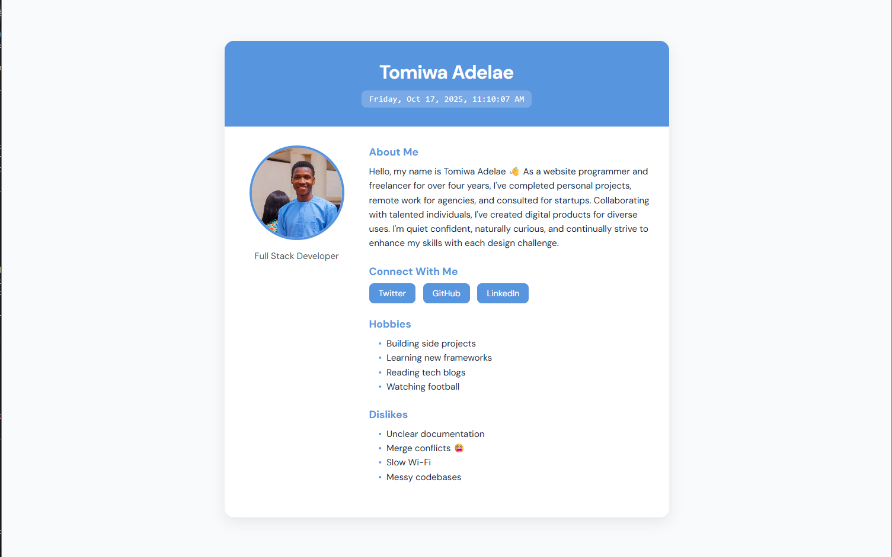

# HNG Internship - Stage 0 Task

This is my **HNG Internship Stage 0 task** project. It displays my
personal information, a dynamic current time (that updates every
second), and a clean responsive design --- all implemented with
**HTML**, **CSS**, and **JavaScript**.

---

## 🚀 Features

- Shows basic personal details (name, email, track, etc.)
- Displays **live updating date & time**
- Fully **responsive design** (mobile-friendly)
- Clean and modern UI with separated CSS and JS files
- Organized project structure and semantic HTML

---

## Tech Stack

- **HTML5** -- structure and semantics\
- **CSS3** -- styling and responsiveness\
- **JavaScript (ES6)** -- for dynamic date/time updates

---

## Folder Structure

    project-folder/
    │
    ├── index.html      # main HTML file
    ├── style.css       # stylesheet for layout and responsiveness
    └── main.js         # JavaScript for time updates

---

## Preview

## 

## ⚙️ How to Run Locally

1.  Clone this repository:

    ```bash
    git clone https://github.com/tomiwa-adelae/HNG-Stage-0.git
    ```

2.  Open the project folder:

    ```bash
    cd hng-stage0-task
    ```

3.  Open `index.html` in your browser.

That's it 🎉

---

## 📅 Dynamic Time Format

The time is automatically updated every second using JavaScript's `Date`
object and formatted like this:

    Friday, Oct 17, 2025 - 10:42:08 AM

---

## 🧠 Author

**Name:** Tomiwa Adelae\
**Track:** Frontend Development\
**Email:** adelaetomiwa6@gmail.com\
**Slack Username:** @tomiwaadelae

---

## 🌐 Live Demo

👉 [View the live project](https://hng-stage-0-lemon.vercel.app/)

---

## 🏁 HNG Internship

This project is part of the **[HNG Internship](https://hng.tech)**
program --- a remote internship designed to help developers gain
real-world experience through hands-on projects and collaboration.

---

⭐ **If you like this project, consider giving it a star on GitHub!**
